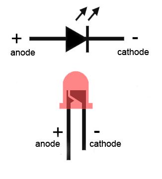
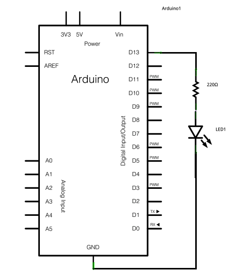

# LED Blink

This program is the `Hello World` of sorts for an Arduino. We light up an LED and make it blink. Collect an LED and a resistor from your lab instructor. A 1k resistor should do just fine.



The longer wire on your LED is the positive terminal, aka Anode. Always connect the Anode to the +ve voltage. Make sure that a resistor is in series with the LED or the LED will let out the [magic smoke](http://www2.ece.rochester.edu/courses/ECE113/materials/smoke.pdf) and die.

Connect the Anode of the LED to Digital Pin 13 of the Arduino and connect the other pin to Ground **_via_** the resistor. Like shown below. Use a breadboard.


| Diagram      | Schematic                         |
| -------------------|-------------------------------|--------|------|
|          |    |


Let's light up the LED now. Connect the Arduino to your computer and open the Arduino IDE. Arduino doesnt need an external power source when connected via the USB wire.

Sketch
------

Programs in Arduino IDE are called _Sketches_. Open a new Sketch. It should look something like this.

```
void setup() {

}

void loop() {

}
```

All the code in `setup() {}` is run once. Things like setting pin-mode are put here.
`loop() {}` contains the code that is done repeatedly.

First, initialise the pin 13 as OUTPUT. Then set it as HIGH using the `digitalWrite()` function.

```
void setup() {
  pinMode(13, OUTPUT);     // Set pin 13 as Output
}

void loop() {
  digitalWrite(13, HIGH);  // Make the pin high.
}
```
Upload the code to the Arduino using the `→` button in your IDE (Top left corner). The LED should light up on uploading and stay lit.

Now try the code below and try to reason by yourself what's happening.
```
void setup() {
  pinMode(13, OUTPUT);                // Set pin 13 as Output
}

void loop() {
  digitalWrite(13, HIGH);             // Make the pin high.
  delay(1000);                        // wait for a second (1000 milli second)
  digitalWrite(13, LOW);              // Now make it sober.
  delay(1000);
}
```

Try different arguments for the delay function.

References
----------
* [pinMode()](https://www.arduino.cc/reference/en/language/functions/digital-io/pinmode/)
* [digitalWrite()](https://www.arduino.cc/reference/en/language/functions/digital-io/digitalwrite/)
* [delay()](https://www.arduino.cc/reference/en/language/functions/time/delay/)