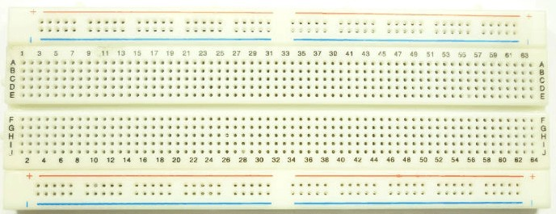
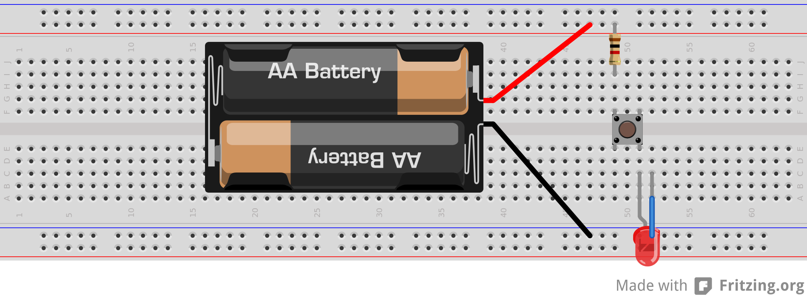
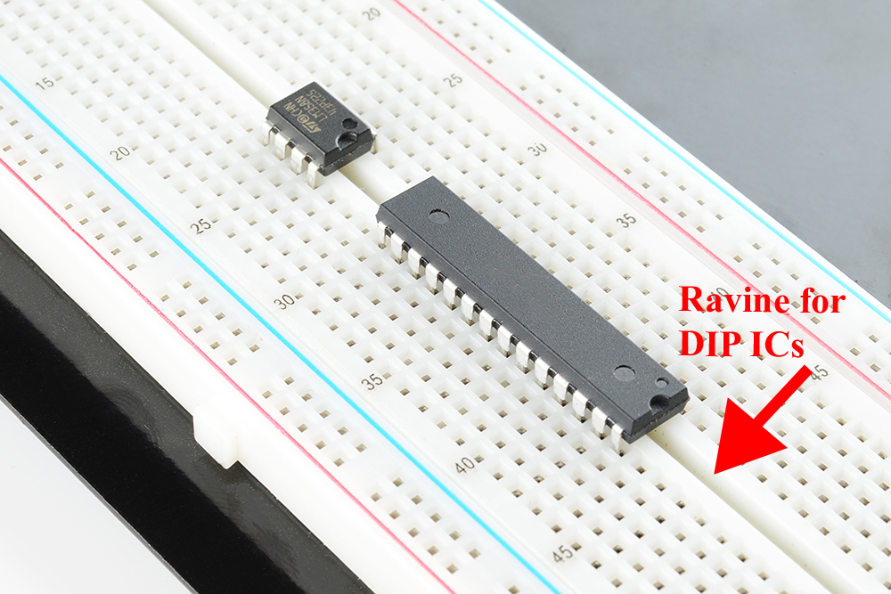

# Breadboards

This page describes the wiring of a breadboard and certain best practises to save your sanity.

::: tip
The side rails are shorted vertically, and the middle strips are shorted horizontally. Observe the metal bars on the right half of the picture. 
:::

If you are given a longer breadboard instead of what's shown in the picture, the vertical shortings are (usually) only half way through. Below is a long board for your reference. Notice how the blue & yellow lines are only half way across? The connections end there.

That should give you an basic idea of how to use a breadboard. Below is a reference image I stole from [www.sciencebuddies.org](https://www.sciencebuddies.org). Observe how the LED is connected to the battery.

::: danger
While we are at it, also notice the resistor in series with the LED. If you connect an LED directly to the battery, you're gonna short it and release some smoke.

An LED is a diode that glows in forward-bias. When a diode is in forward bias, it has no resistance. Consequently, a large amount of current flows because I = V/R and R = 0.

I burnt quite a few LEDs that way.
:::

Now, time for some best practises.

# Best Practises

Just like indenting your code helps you understand you program flow faster, following some conventions can help you understand your circuits better, and debug faster.

* **Colour code your wires**. I use RED wires for +ve, BLUE for -ve, and GREEN for ground. YELLOW are the inputs, and WHITE are the outputs. Orange wires are common connectors, and so on.

* **Face all your ICs the same way**.

  

  You'll learn why when you start using ICs. Use a pen to remove an IC from breadboard carefully.

* **Be consistent which rail is +ve and which is -ve**. I usually keep the outside vertical rails +ve and the inside ones -ve. Stops you from making silly errors and shorting the equipment.

You'll learn more conventions as you build circuits, but remember that they are helpful only when you stay consistent.

-------

### Image sources
* https://commons.wikimedia.org/wiki/File:Button_LED_bb.svg
* https://learn.sparkfun.com/tutorials/how-to-use-a-breadboard
* http://www.stuartconner.me.uk/tms9995_breadboard/tms9995_breadboard.htm
* https://learn.sparkfun.com/tutorials/how-to-use-a-breadboard/anatomy-of-a-breadboard

