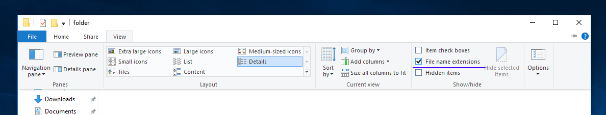

## Windows only

Windows sucks. For several reasons. I really recommend Ubuntu or MacOS.

### Step 1
1. Go here: [https://sourceforge.net/projects/gnuplot/files/gnuplot/5.2.4/](https://sourceforge.net/projects/gnuplot/files/gnuplot/5.2.4/) and download `gp524-win64-mingw_2.exe`
2. In the `Select additional tasks` step of installation,
    - Make default TERM `Windows`
    - **Enable `add application directory to PATH...`**

### Step 2
1. Create a new folder on your desktop and name it `plots` and open it
2. Now enable file extensions. Click `view` on the folders navigation bar, and select `file name extensions`

3. press and hold `shift` key and right-click inside the folder.
4. Select 'Open Powershell window here'. A terminal should open.

[Next: Your first plot](../1/1.md)