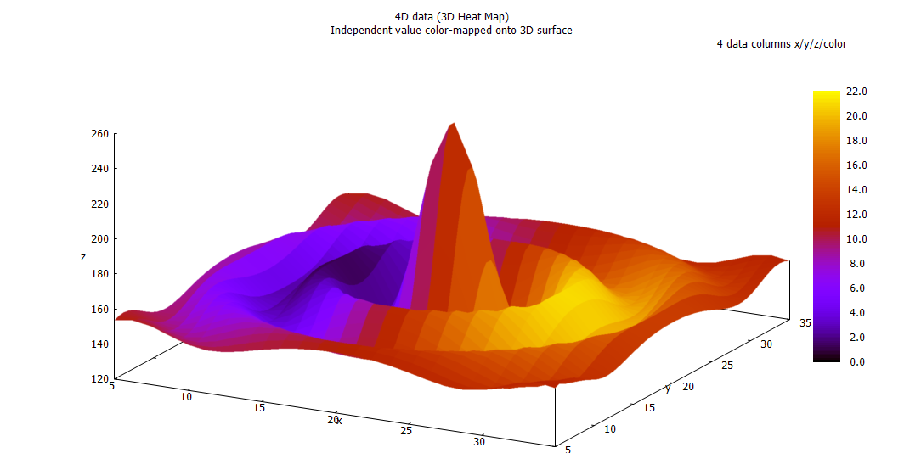

# GNUPlot



```
GNUPlot is an amazing tool to plot data.
- Aravind, 2018
```
But you knew that already anyway. Let's get started.


First, install [Sublime Text](https://www.sublimetext.com/).
After that, do the following steps


## MacOS
`brew install gnuplot  --with-aquaterm`

## Debian Linux (Ubuntu, etc)
`sudo apt install gnuplot`

## Windows
[Click Here](../0.5/0.5.md)


---------

[Next: Your first plot](../1/1.md)
