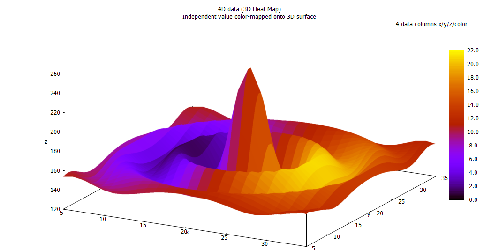

# GNUPlot



```
GNUPlot is an amazing tool to plot data.
- Aravind, 2018
```
But you knew that already anyway. Let's get started.


## MacOS
`brew install gnuplot  --with-aquaterm --with-qt4 --with-x11`

## Debian Linux (Ubuntu, etc)
`sudo apt install gnuplot`

## Windows
1. My condolences. 
2. Go here: [https://sourceforge.net/projects/gnuplot/files/gnuplot/5.2.4/](https://sourceforge.net/projects/gnuplot/files/gnuplot/5.2.4/) and download `gp524-win64-mingw_2.exe`
3. In the `Select additional tasks` step of installation,
    - Enable `Create Desktop Icon` checkbox
    - Make default TERM `Windows`
    - Enable `add application director to PATH...` 
4. Poke around the UI


