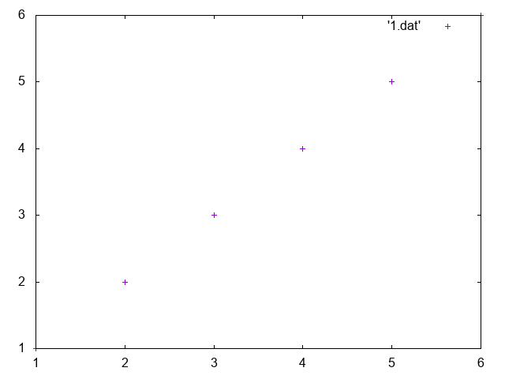
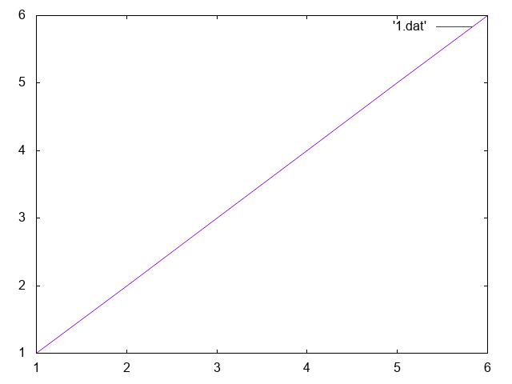
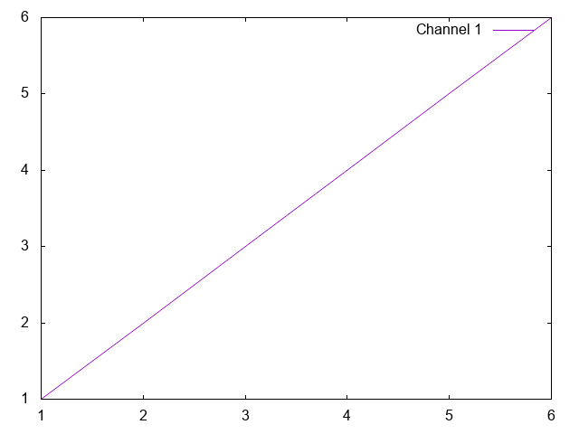

# Your first plot
(With gnuplot ofcourse. Not your first ever plot.)

## Step 1

Create a new folder `plots` on your Desktop, and open your terminal in that folder.


::: tip Ubuntu & MacOS
Fire up your Terminal. CD your terminal to the directory.
``` bash
mkdir ~/Desktop/plots
cd $_
```
:::

## Step 2

1. Create a new file `1.dat`. Open it in Sublime text and enter the following data in it.

```
1 1
2 2
3 3
4 4
5 5
6 6
```


2. Save 1.dat and create a new file called `1.gp` and type the following code in it.

```
set output '1.png'

set terminal png truecolor

plot '1.dat'
```

* The first line sets the output file name.
* The second line set's the type of the output. You don't really need to fiddle with this.
* The third line specifies which data file to plot.

## Step 3
Run it in your terminal. You should see an image named `1.png` with the graph.
``` bash
gnuplot 1.gp
```
  

## Step 4
* Try replacing the last line in `1.gp` with `plot '1.dat' with lines` and run gnuplot again.
  

## Step 5
* Nice! We got line plots working. Let's set the title for the line. Replace the last line with `plot '1.dat' with lines title 'Channel 1'`
  

----------

So far, your gnuplot file should look something like this.

```
set output '1.png'

set terminal png truecolor

plot '1.dat' with lines title 'Channel 1'
```

[Next: Make it (even) better](../2/2.md)