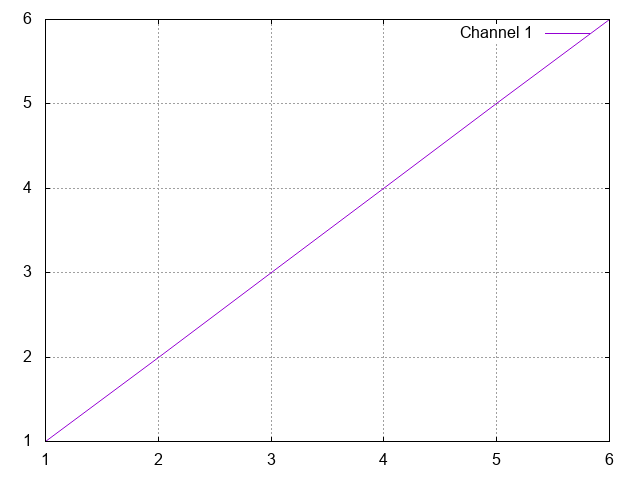
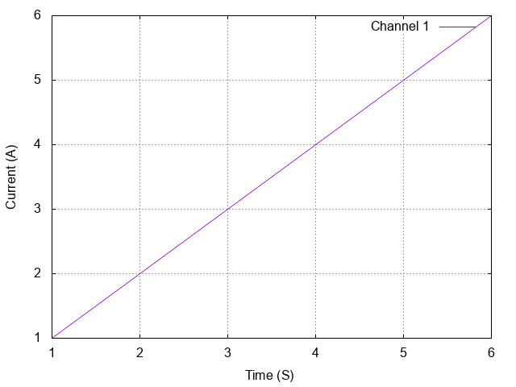
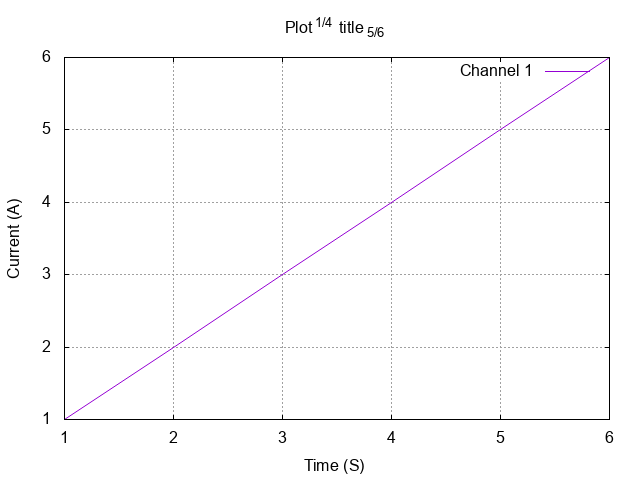

# Make it better

## Step 1
You can turn on grid by adding `set grid` line somewhere in the gnuplot file. A grid is useful once in a while.

``` {6}
# lines starting with a # are comments btw

set output '1.png'

set terminal png truecolor                          # Set output type to png
set grid                                            # Turn on grid in plot

plot '1.dat' with lines title 'Channel 1'
```

  


## Step 2
Let's set the labels for X and Y axis. 
``` {8,9}
# lines starting with a # are comments btw

set output '1.png'

set terminal png truecolor                          # Set output type to png
set grid                                            # Turn on grid in plot

set xlabel "Time (S)"
set ylabel "Current (A)"

plot '1.dat' with lines title 'Channel 1'
```
  

## Step 3
Set a title to the graph.
``` {6,7,8}
set output '1.png'

set terminal png truecolor                          # Set output type to png
set grid                                            # Turn on grid in plot

set title "Plot^{1/4} title_{5/6}"
# You can add a super-script with the ^{} syntax. This works in X, Y labels too.
# Similarly, _{} adds a subscript

set xlabel "Time (S)"
set ylabel "Current (A)"

plot '1.dat' with lines title 'Channel 1'
```
  

--------------

[Next: Multiple plots in one image](../3/3.md)