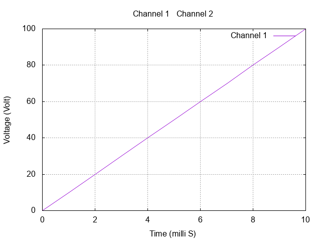
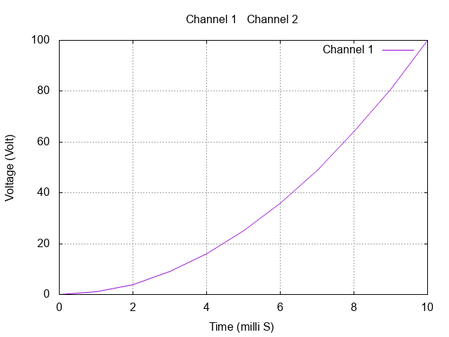
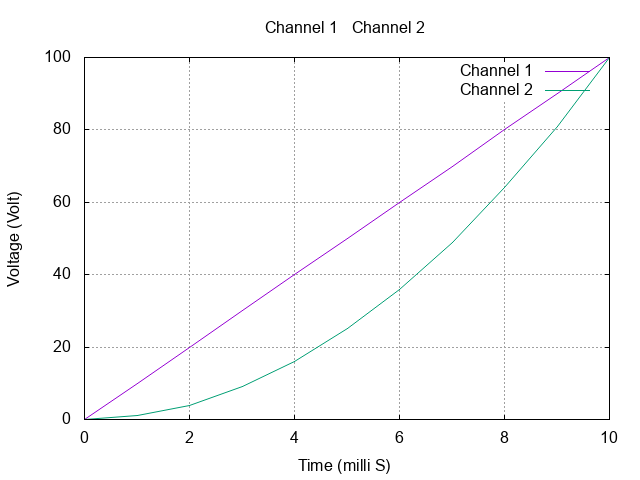

# Multiple plots in one file

More often than not, the files you store from the Oscilliscope have three columns. The first column is time, the second from Channel 1, and the third from Channel 2.


For example, consider the data shown below.
```
0,0,0
1,10,1
2,20,4
3,30,9
4,40,16
5,50,25
6,60,36
7,70,49
8,80,64
9,90,81
10,100,100
```
::: tip
Note that the columns are separated by commas. CSV expands to _Comma Separated Values_. You have to use `set datafile separator ","` when plotting CSV files.
:::

::: warning
Oscilloscope adds some text at the top. Usually name of the row and units. You have to remove it before plotting with gnuplot.
:::


<!-- [this link](https://raw.githubusercontent.com/zeroby0/edct-lab/master/edctLab2017/lab%20reports/lab%20report%200/Lab%200/0/Input%20vs%20output.csv?token=AQHrhOmlkxPZ9UJ031zVKs4MGdHbeDuOks5bfHCkwA%3D%3D)  -->

## Step 1
* Create a new file called `2.csv` and copy the data from above into it.
* Copy the following code into `2.gp`
``` {14,16}
# 2.gp

set output '2.png'

set terminal png truecolor            # Set output type to png
set grid                              # Turn on grid in plot

set title "Channel 1 & Channel 2"

set xlabel "Time (milli S)"
set ylabel "Voltage (Volt)"

# Enable when columns are separated by commas (CSV)
set datafile separator ","

plot '2.csv' using 1:2 with lines title 'Channel 1'
```

## Step 2
See the `using 1:2` part? We are telling gnuplot to use 1st column for X and 2nd column for Y. If you plotted with this now, you'd see something like this.
  

## Step 3
Go ahead and change `using 1:2` to `using 1:3` and plot. What do you get?
  

Now gnuplot is using 1st column for X and 3rd column for Y.

## Step 4
Now, let's plot both of the curves together. Change the last line to
```
plot '2.csv' using 1:2 with lines title 'Channel 1', \
     '2.csv' using 1:3 with lines title 'Channel 2'
```
  

Infact, since both the data files are `2.csv`, you can leave the space between second quotes blank. Like this.
```
plot '2.csv' using 1:2 with lines title 'Channel 1', \
     '' using 1:3 with lines title 'Channel 2'
```
This should give the same plot as above.

## Step 5
Can you make plots if the data is in **two** different files? If the data is in 2 files, say `a.csv` and `b.csv`, you can do this:
```
plot 'a.csv' using 1:2 with lines title 'From a.csv', \
     'b.csv' using 1:2 with lines title 'From b.csv'
```

-----------

[Next: Set Xrange](../4/4.md)


