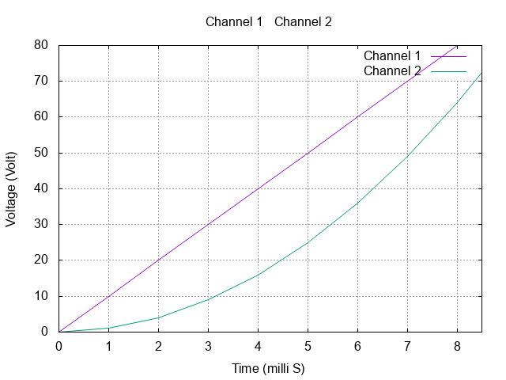

# Set Xrange and Yrange

Suppose you'd like to limit the range for X axis in your plot. You can do it with `set xr [Start:End]`. For example, in the previous gnuplot file
```{16}
# 2.gp

set output '2.png'

set terminal png truecolor            # Set output type to png
set grid                              # Turn on grid in plot

set title "Channel 1 & Channel 2"

set xlabel "Time (milli S)"
set ylabel "Voltage (Volt)"

# Enable when columns are separated by commas (CSV)
set datafile separator ","

set xr [0:8.5]

plot '2.csv' using 1:2 with lines title 'Channel 1', \
     '2.csv' using 1:3 with lines title 'Channel 2'
```
The output would be limited from 0 to 8.5 in X. Similarly, you can use `set yr [Start:End]`


[Next: Set Xtic, Ytic](../5/5.md)