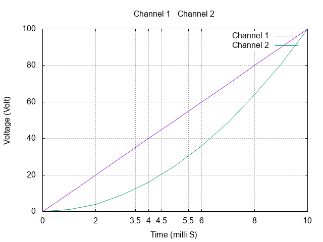

# Set Xtic and Ytic

To highlight the graph at a particular of X axis, you'd use xtic. For example, this adds xtics at 3.5, 4.5, and 5.5
```{16}
# 2.gp

set output '2.png'

set terminal png truecolor            # Set output type to png
set grid                              # Turn on grid in plot

set title "Channel 1 & Channel 2"

set xlabel "Time (milli S)"
set ylabel "Voltage (Volt)"

# Enable when columns are separated by commas (CSV)
set datafile separator ","

set xtic add(3.5, 4.5, 5.5)

plot '2.csv' using 1:2 with lines title 'Channel 1', \
     '2.csv' using 1:3 with lines title 'Channel 2'
```
  

You can also try using `set xtic auto`. You can do the similar thing with `ytic`.

[Next: Template for gnuplot](../6/6.md)