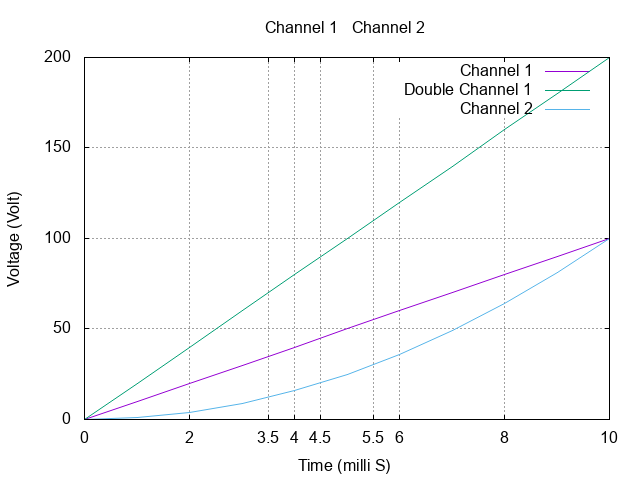

# Conclusion

There's a **lot** more to gnuplot than what I was able to cover in this tutorial.

For example, you can do arithmetic on a column like this: `using 1:(2*$2)`. The second column will be doubled in the plot.
```
plot '2.csv' using 1:2      with lines title 'Channel 1', \
	 '2.csv' using 1:(2*$2) with lines title 'Double Channel 1', \
     '2.csv' using 1:3      with lines title 'Channel 2'
```
 

------

Then there are inbuilt Trignometric and other Mathematical functions, and even [userdefined functions](http://gnuplot.sourceforge.net/docs_4.2/node60.html) are supported! But they lie outside the scope of this tutorial and the course and will not be discussed here.

You are encouraged to further explore gnuplot by yourself.

If you'd like to learn another new thing, I really recommend the markdown tutorial [here](https://guides.github.com/features/mastering-markdown/). The entire [content](https://github.com/zeroby0/belab.xyz) of this website is written in Markdown.


