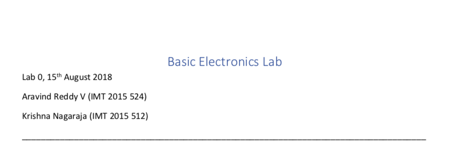
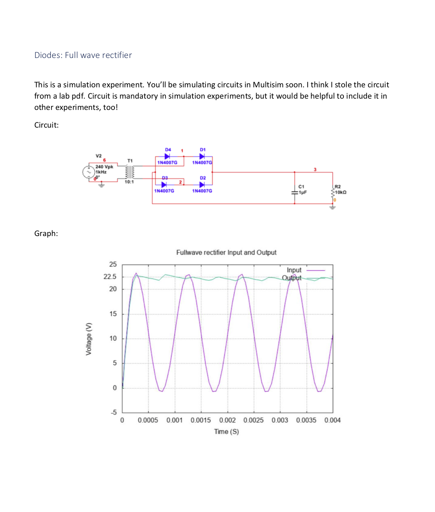

# How to write your lab reports

## Submission
* Make sure your submission is a PDF. Other formats are not accepted.
* Rename your submission to your rollnumber. For example, my submission would be `IMT2015524.pdf`.

## Template
Available [here](/docs/Labreport.docx)

## Header
* The heading should be Basic Electronics Lab.
* Subheading is the Lab number.
* Make sure to include your and your labpartner's details in the header.

Example:

## Experiment
* The experimnet heading
* Any notes you might want to add (optional)
* Circuit (if required)
* Graph

Example:

## Graphs
* Use [gnuplot](https://app.belab.xyz/guides/gnuplot/0/0.html).
* The graph and the answer heading should be in the same page.
* Should be vertically centered on the page.
* Should contain X and Y numerical values on the axes, not in the middle of the plot.
* The values should not be in exponential (X\*e^Y) form.
* The labels for X and Y should be on the axes, not in the graph legend. The legend is to indicate the meaning of the line, not the units.
* The label for X and Y should contain the correct units for the plot.

## General
* Minimise the number of colours you use in the pdf, except for graphs.
* Keep your report clean and readable.
* Don't add unnecessary images or content.
* A simple report like [this](/pdf/IMT2015524.pdf) should do just fine.
* If you're gonna add unnecessary images or content, go **full overboard**. Like [this](/pdf/Assignment3_IMT2015_524_504.pdf) or [this](/pdf/PrecisionRectifiers.pdf).
