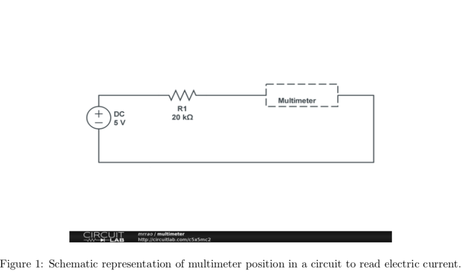
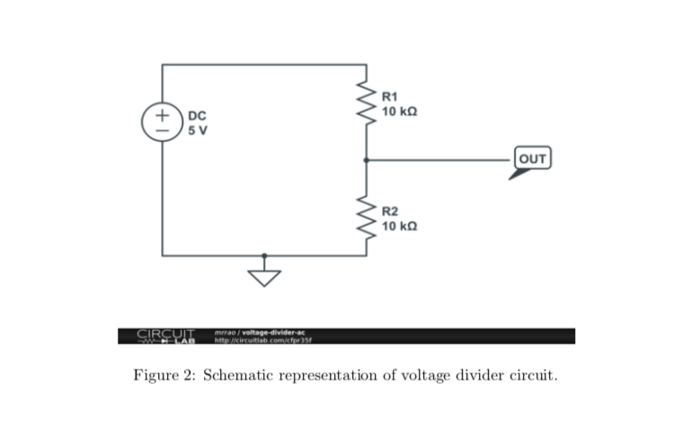

::: warning Note
The content of this page may be outdated until the day of the lab.
:::

Resistive Circuits
==================

In this lab, you will learn little bit of everything: resistors, breadboard, and multimeter. This will get you started on building circuits.

* [Guide to breadboards](../guides/breadboard.md)
* [Calculating Resistance](../guides/resistors.md)

Reading Resistors
-----------------

* Open the color coding PDF file from LMS or dropbox and read the (three) resistors at your end.
* Check the same using multimeter and breadboard at your end. Your instructor will show you how to
use multimeter and breadboard.
* Horizontal bus (top and bottom two) lines in the breadboard are shorted. Vertical lines are shorted too. The breadboard is divided into two sections. Use wiring to check whether this is true.

Kirchoffs law
-------------

* Current Law: Sum of currents into a point is equal to sum of currents going out (conversation of charge).
* Voltage law: Sum of voltage drop in a closed circuit is zero. Application of these two laws are:
Current in series of resistors remain same
Voltage in a parallel of resistors remain same.
* Equivalent resistance for resistors in series, the larger resistor dominates. Equivalent resistance for resistors in parallel, the smaller resistor dominates.

I-V characteriztics of Resistors
--------------------------------

* Verify Ohms law for a resistor of 20 K Ω. (If you cannot find 20 K Ω then try getting multiple resistors in series or parallel combination). Apply 5 V using Power supply and measure the current using multimeter. Your instructor will explain the multimeter operations. Build your circuit as shown in Figure 1.
Then decrease the voltage from 5 to -5 V in steps of 1 V. Change the wires/cables position in the Power supply to provide negative voltage. Note down the applied voltage and current read from multimeter.
* Repeat the same for 10 K Ω. Make sure that you plot a graph for 20 K Ωand 10 K Ωresistance values in one graph and provide a plot in your lab report.

Voltage divider circuit
-----------------------

* Voltage divider circuits: Make a voltage divider circuit of 10 K Ωand 10K Ωand measure the voltage across one of the 10 K Ω. Build a circuit as shown in the Figure 2.
Vary the DC voltage from -5 to 5 V in steps of 1 V and measure the voltage across the lower 10 K Ω. Plot the graph in your lab report.
* Use the same circuit, replacing R2 with 100 k Ωand then provide your observation. This circuit shows that as R2 increases, more input voltage is produced at the output.
* Design rule of thumb: When circuit A drives circuit B: RA should be 1 RB then divider delivers 10
10 11
of the signal: attenuation is only 10% and that is good for most of the applications.
* Apply the AC (time varying) voltage to the divider circuit (with the design rule of thumb) and observe the output voltage.

