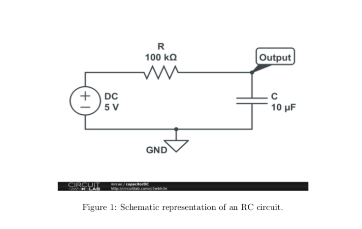
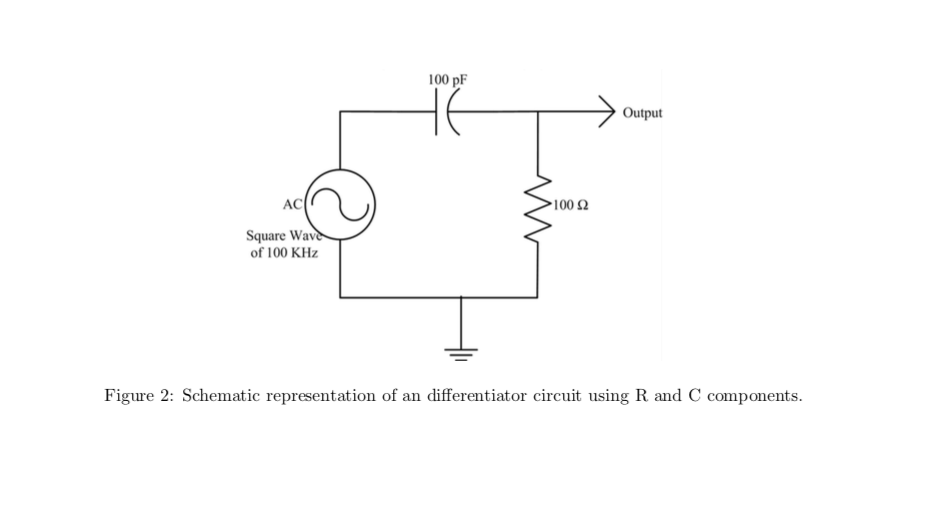
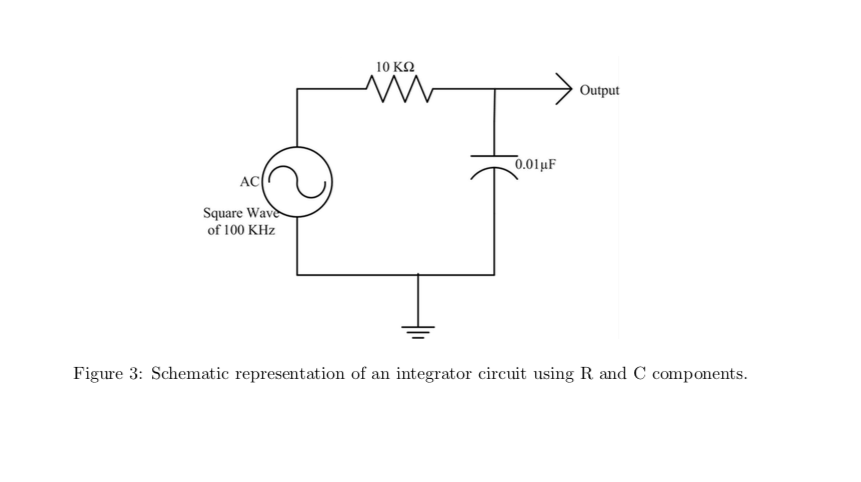

::: warning Note
The content of this page may be outdated until the day of lab.
:::

RC Circuits
===========

Reading capacitors
----------------
* Big capacitors (Electrolytic) capacitors are easy to read. For example: 500MF represents 500 micro farad. All big capacitors are polarized.
* Tantalum capacitors are silvered colored cylinders. They are also polarized with a + mark and metal nipple mark the positive end. For example 4R7μ represents 4.7 μF. R marks the decimal places.
* The same capacitor may also be marked as +475K which means 47 × 105 pF (4.7 μF). A pF is 10−6 times samller to μF.
* Mylar capacitors are yellow cylinders. 0.01 M is jut 0.01 μF. These caps are not polarized; the black band marks the outer end of the foil winding. Orient them at random in your circuits.
* Cermaic capacitors are little orange like pancakes. Very good for high frequencies. For example the reading
> 
         2
         Z5U
         0.02 M
         1 kV.

means Z5U : ceramic capacitor type
M is 20 % tolerance marking. 0.02 means 0.02 μF. 560 M means 560 pF. 1 kV means the capacitor can stand 1000 V.

* CK05 are little boxes with their leads 0.2 inch apart. They are handy for inserting into a printed circuit. This has resistor like marking. 101K is 100 pF.
* In some cases, the capacitors polarity can be identified as cathode (shorter lead) and anode (long lead). Anode represents positive polarity, where as shorter one represents negative polarity.
Capacitors conduct current only for a differential change in voltage across it. The capacitor can charge to a maximum posible ratings and can discharge back to close zero (ideally). This property of capacitor to retain its original value is heavily used in electronics industry in the form of switches, actuators, switches and many more. Relation of capacitance and voltage with charge is shown below:
> Q=CV

* The instructor will explain the capacitor equation. Visualize how this curve will look like.

* Check the RC (time-constant) while charging and discharging. Connect a Resistor of 100 k Ωand a capacitor of 10 μF as shown in the Figure 1. Note that this capacitor has a long terminal which is positive and short terminal which is the negative polarity.
Apply a DC voltage of 5 V to the circuit. Measure the change in voltage across the capacitor in the Oscilloscope. For getting the signal on the Oscilloscope, you may have to turn the time/div and volts/div knob and position level appropriately. Notice that after few seconds, the voltage remains constant.
* Switch off the power supply and notice a drop in voltage across the capacitor.
* Now switch on the power supply i.e the capacitor gets charged. After 10 seconds, connect the wire going from the breadboard to the positive of the power supply, to ground of your circuit. Note that ground of your circuit should be common to instruments negative terminal. Check the discharge cycle and time it takes to discharge. What is the differance between the earlier discharge time and this particular discharge time.
* Let us apply AC square wave signal of 5 Vp-p, 1 Hz from the signal generator instead of DC supply. Check the charging and discharging of the signal. Capture one such cycle of charging and discharging with respect to input signal and produce the plots in the lab report. Determine the time constant for the output to drop to 37%. Does this equal the product RC ? Measure the time to climb from 0% to 63%. Is it same as that of time to fall to 37%.

Differentiator and Integrator
-----------------------------
* Differentiator circuit: Build the circuit on the breadboard as shown in the Figure 2. Check your output for triangle wave input of 10 Vp-p. Capture the image of input and output in CSV format and draw this plot in your lab report.
* Integrator circuit: Build the circuit on the breadboard as shown in Figure 3.
Check your output for square wave input of 10 Vp-p. Capture the image of input and output in CSV
format and draw this plot in your lab report.

Multisim
--------
Multisim is a simulation tool made available by National Instruments. This simulation tool is a drag and drop tool to simulate your electronic circuits. Your instructor will guide you in getting started with Multisim. You can use this tool, to build your circuit and then use the image in your lab reports.
Repeat the I-V experiments for 10K Ωand 20K Ω. Also repeat the voltage-divider circuit of 10K Ωand 10K Ωand provide the plot of simulation in your lab report.
Also verify whether the RC Differentiator and Integrator circuits work in Multisim as you have realized in Experiments.