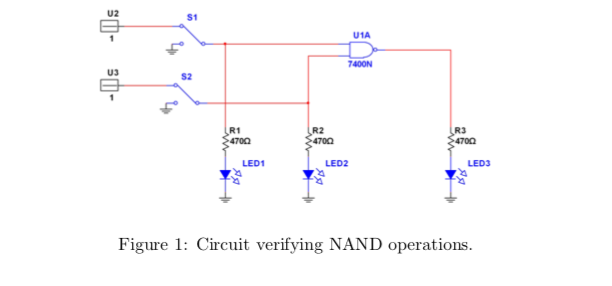
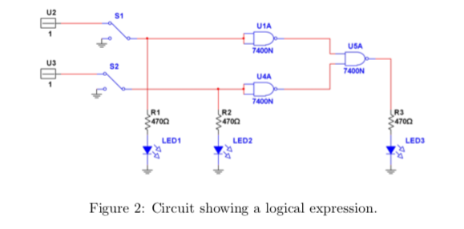
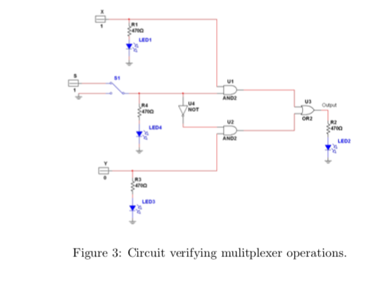

# Digital Logic

Digital signal takes on only two values: `1` and `0`. This binary nature allows logic to be performed electronically. 

In this laboratory you will experimentally verify the truth table for below gates and then verify few logic expressions.
```
NOT
AND
OR
NAND
NOR
XOR
XNOR 
```


You will be asked to show a demo on one logic expression after completing the entire set of experiments. You will be asked to draw a graph of input and output voltage and show to the instructor.

_There will be no lab report for this experiment._

## Gates IC74XX

`IC7400` IC are logic gates. Complete list can be found [here](https://en.wikipedia.org/wiki/List_of_7400-series_integrated_circuits).

Gate | Number
-----|-------
NOT  | IC7404
AND  | IC7408
OR   | IC7432
NAND | IC7400
NOR  | IC7402
XOR  | IC7486
XNOR | IC74xx


## Logic circuit
Connect the circuit as shown in the `Figure 1` and verify the truth table for this logic. The datasheet of IC7400N is available in the dropbox and LMS. 

::: warning Note
Make sure that the LED is added to the circuit in series with a resistor (470 Ohm).
Glowing of the LED will represent `1` for input and output.
:::



Provide an input of 5V DC power supply for logic `1`. Note that a switch exists between the two signals. Intially connect both signals to DC power supply of 5V each. Toggle the switches to determine the variation in the output and verify the truth table.

Change one of the inputs to `AC Sine wave (5 Vp-p + 2.5 V DC offset)` and and keep other input fixed at logic `1`. Capture the input AC and output voltages from the Oscilloscope. Repeat the same for AC square wave and triangle wave.

Similarly verify other gates available to you such as: IC7402, IC7404, IC7486, and IC7432.

## Logic Expression

Connect the circuit as shown in the `Figure 2`. 

1. Determine the truth-table for this experiment. 
2. If one of the input is changed to `AC Square wave (5 Vp-p + 2.5V DC)` as shown in the Figure, capture and plot the input and output voltages.



## Multiplexer

Multiplexing means to transmit a large number of units over a smaller number of channels or lines.

A digital multiplexer is a combinational circuit that selects binary information from one of many input lines and directs it to a single output line. The selection of a particular input line is controlled by a set of selection lines (also inputs). Below is a `figure 3` showing the logic diagram for 2:1 multiplexer.

1. Verify the truth table for multiplexer.
2. Now change one signal to `AC Square wave (5 Vp-p + 2.5 V DC offset)` and check the output by pressing and depressing the select line.



